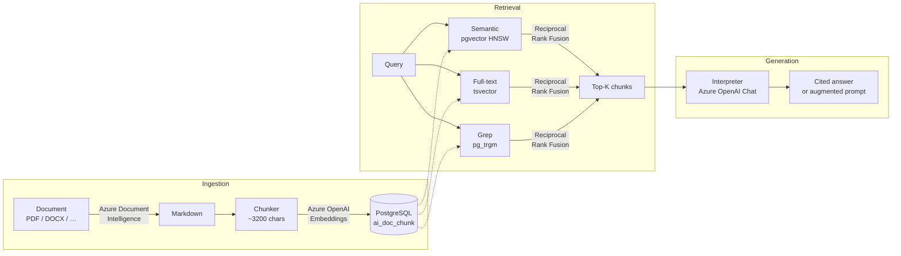

# semantic-grep (`segrep`)

Prototype CLI for semantic and hybrid search across many documents (PDF, DOCX, XLSX, PPTX, images, etc.).

## Purpose

- CLI-only — no GUI/web boilerplate, just the retrieval design
- Rapid prototyping; shareable with external consultancy without exposing internal code
- CLI is the natural interface for agents alongside MCP
- Once the POC is validated, this codebase serves as a reference for agents that design the full product

## Architecture



## External Services

| Service | Role |
|---|---|
| **Azure Document Intelligence** | Parse unstructured documents into Markdown |
| **Azure OpenAI** (embeddings) | Embed chunks for vector search |
| **Azure OpenAI** (chat) | Expand queries and compose cited answers |
| **Azure OpenAI** (vision, optional) | Describe figures/images during `index --describe-images` |
| **PostgreSQL** (+ `pgvector`, `pg_trgm`) | Store and search chunks |

> Standard pricing tier required for Azure Document Intelligence files > 4 MB

Localhost connection string: :-)
> Host=127.0.0.1;Port=5432;Database=postgres;Username=postgres;Password=postgres

## Quick Start

```bash
dotnet run --project Segrep -- configure   # set credentials interactively
dotnet run --project Segrep -- status      # verify service connectivity
dotnet run --project Segrep -- index ./docs
dotnet run --project Segrep -- index ./docs --describe-images   # also caption figures with the vision model
dotnet run --project Segrep -- ask "What are the key risks in the reports?"
```

Installed from a release (see `install.sh`), `segrep` can update itself in place:

```bash
segrep update --check   # report whether a newer release exists
segrep update           # download, verify (SHA-256), and self-replace
```

## Libraries

- [Spectre.Console](https://spectreconsole.net) — CLI rendering and command routing

## References

- [How to design a good CLI tool](https://clig.dev/)
- [Spectre Console CLI tutorial](https://spectreconsole.net/cli/tutorials/quick-start-your-first-cli-app/)
- [Azure Content Understanding](https://azure.microsoft.com/en-us/products/ai-foundry/tools/content-understanding)
- [Docling: document processing for generative AI](https://www.redhat.com/en/blog/docling-missing-document-processing-companion-generative-ai)
- [Semantic Kernel Rankers](https://github.com/kbeaugrand/SemanticKernel.Rankers)