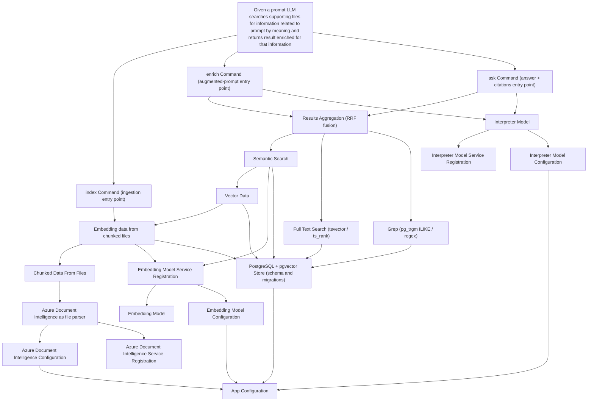

# Task Graph

> **Edge direction:** `A --> B` means **A depends on B** (B must be done first).
> Leaves (e.g. `App Configuration`) are the foundational work; the epic sits at the top.
> This maps to beads as "A is blocked by B".

**Commands**
- `index [<path>]` — ingest a folder (all supported files) or a single file: parse → chunk → embed → store.
- `enrich <prompt> [--raw]` — retrieve relevant context and return the prompt augmented with it (a ready-to-pipe prompt). Default uses the Interpreter Model to interpret/expand the prompt; `--raw` embeds it verbatim and skips the LLM.
- `ask <prompt>` — retrieve relevant context and return an LLM-composed answer with `[source: file #chunk]` citations.

